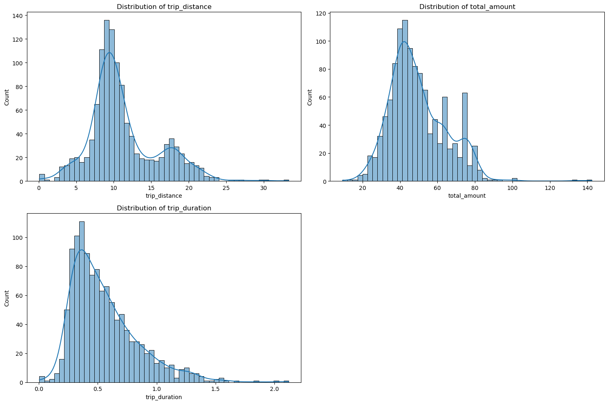
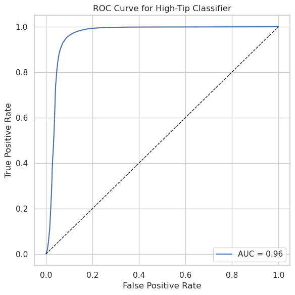
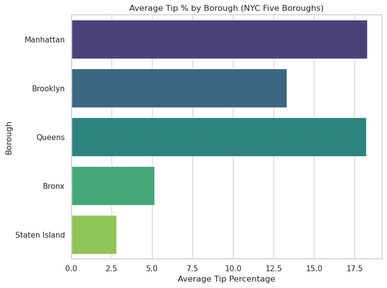

# TaxiTripProbabilityInNYC

An end-to-end PySpark pipeline that predicts whether an NYC Yellow Taxi passenger will tip ≥15% of the fare, built on Google Cloud (GCS + Dataproc). The project covers data acquisition, cleaning, feature engineering, modeling, and visualization for ~3M+ trip records.

## Project Overview

Using only trip-level attributes (distance, duration, time, location, and surcharges), this project frames tipping behavior as a binary classification problem and trains a Logistic Regression model to distinguish "good tippers" from other riders. Beyond prediction, the analysis surfaces the key drivers of tipping which are fare size, borough, and rate code to support driver incentive design, customer targeting, and dynamic pricing strategies.

## Dataset

[TLC Trip Record Data](https://www.nyc.gov/site/tlc/about/tlc-trip-record-data.page), focused on Yellow Taxi trips. Key fields: pickup/dropoff timestamps, trip distance, passenger count, fare components, payment type, and pickup/dropoff zone IDs.

## Architecture

```
TLC Cloudfront (Parquet) → GCS "landing" bucket → Dataproc (single-node, EDA)
→ Dataproc (5-node, PySpark cleaning) → GCS "cleaned"
→ Feature Engineering (Spark ML Pipeline) → GCS "trusted"
→ Logistic Regression + CrossValidator → GCS "models"
→ Evaluation & Visualization (Pandas/Matplotlib/Seaborn)
```

## Pipeline Stages

### 1. Data Acquisition (`src/01_data_acquisition.py`)

Downloads monthly Yellow Taxi parquet files from the TLC Cloudfront endpoint and uploads them to a structured GCS bucket (`landing/`, `cleaned/`, `trusted/`, `models/`).

### 2. Exploratory Data Analysis (`src/02_eda.py`)

Run on a single-node Dataproc cluster. Surfaces key data quality issues:

- Anomalous timestamps (trips from 1970, 2001, 2026)
- Trip durations ranging from -28M minutes to 10,000+ minutes
- ~984K zero-passenger trips and 1.5M zero-distance trips
- Outlier fares (tips up to $4,174, tolls up to $1,702)
- Schema/dtype inconsistencies across monthly files



Core monetary and duration fields were all heavily right-skewed — most rides are short, cheap, and quick, with a long tail of outliers. This is what motivated the log-transform step in feature engineering below.

### 3. Data Cleaning (`src/03_data_cleaning.py`)

Run on a 5-node Dataproc cluster with PySpark:

- Standardizes column dtypes across all monthly files
- Drops irrelevant columns (`VendorID`, `store_and_fwd_flag`)
- Filters null/zero passenger counts, zero/negative fares, unrealistic outliers (fare cap $1000, tip cap $100, distance cap 50 mi, duration cap 3 hrs)
- Fills missing surcharge values with zero

### 4. Feature Engineering & Modeling (`src/04_feature_engineering_modeling.py`)

- **Time features:** month, day-of-week, hour → season, weekday/weekend, time-of-day bucket
- **Cost features:** consolidated `extra_charge` (tolls + fees + surcharges), verified against `fare_amount`
- **Location features:** pickup/dropoff borough via TLC zone lookup table
- **Airport flag:** derived from `RatecodeID` (JFK/Newark)
- **Target:** `tip_label` = 1 if `tip_amount ≥ 15% of fare_amount`, else 0
- Categorical features → `StringIndexer` → `OneHotEncoder`; continuous features → log transform (fare, duration) → `VectorAssembler` → `MinMaxScaler`
- Model: Logistic Regression, 70/30 train-test split, 3-fold `CrossValidator` grid search over `regParam` and `elasticNetParam`, selected on AUC

### 5. Visualization & Evaluation (`src/05_visualization.py`)

ROC curve, actual vs. predicted label distributions, top logistic regression coefficients, calendar heatmap of tip % by day/month, seasonal box plots, fare/distance vs. tip % scatter plots, and average tip % by borough.

## Results

| Metric    | Score  |
| --------- | ------ |
| Accuracy  | 94.21% |
| Precision | 93.65% |
| Recall    | 97.96% |
| F1 Score  | 95.76% |
| AUC       | 0.96   |



**Confusion Matrix**

|                  | Predicted: Low | Predicted: High |
| ---------------- | -------------- | --------------- |
| **Actual: Low**  | 966,124        | 148,229         |
| **Actual: High** | 45,540         | 2,185,666       |

**Top drivers of a high tip (by logistic regression coefficient):** scaled total fare (dominant), standard rate code, non-airport rides, and pickup/dropoff in Manhattan. Season had near-zero influence.



Queens and Manhattan lead at roughly 18% average tip, Brooklyn follows around 13%, and the Bronx and Staten Island trail at about 5% and 3% respectively — a pattern likely reflecting differences in trip purpose, passenger demographics, and fare levels across boroughs.

**Key correlations:** fare, distance, and total cost move together (r > 0.8); tips and extra charges are moderately correlated with cost (r ≈ 0.3–0.5); passenger count is essentially independent of cost (r ≈ 0).

## Tech Stack

- **Cloud:** Google Cloud Storage, Google Cloud Dataproc (single-node + 5-node PySpark clusters)
- **Processing:** PySpark, Spark ML (Pipelines, StringIndexer, OneHotEncoder, VectorAssembler, MinMaxScaler, LogisticRegression, CrossValidator)
- **Analysis/Viz:** Python, Pandas, Matplotlib, Seaborn

## Future Work

- Experiment with Gradient Boosting or Random Forest classifiers
- Incorporate real-time streaming features
- Extend to multi-class tipping thresholds
